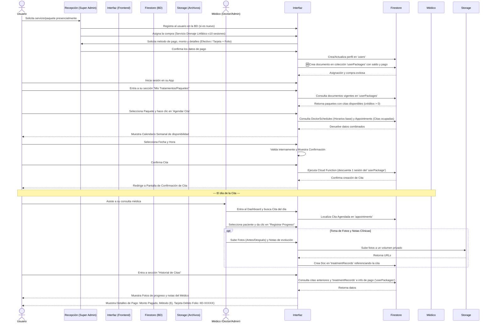

# Flujo de Citas, Compras e Historial Clínico (Elanza)

Este documento describe detalladamente el flujo funcional y la arquitectura necesaria para implementar la agendación de citas, validación de reglas de negocio, registro de compras y el progreso clínico con fotografías para la plataforma **Elanza**.

## 1. Arquitectura de Colecciones Inicial y Nueva Propuesta

Basado en el nuevo flujo donde los usuarios adquieren citas (individuales o por paquetes) directamente en la clínica con un Super Administrador, la arquitectura ideal requeriría una **nueva colección** para manejar estas compras/créditos de servicios.

### Colecciones Existentes:
- **`users`**: Perfil general del usuario.
- **`services`**: Catálogo completo de servicios disponibles en la clínica.
- **`doctors`**: Relación usuario → doctor + metadata clínica.
- **`doctorSchedules`**: Horarios base semanales.
- **`appointmentSlots`**: Slots generados (disponibilidad real).
- **`appointments`**: Citas agendadas confirmadas.
- **`treatmentRecords`**: Historial clínico / notas y fotos del progreso de citas finalizadas.

### 🆕 Nueva Colección Sugerida: `userPackages` (o `purchasedServices`)
Para soportar el registro de los pagos y asignar un "saldo de citas" al usuario.
- **Por qué crearla:** Si añadimos los pagos directo a un arreglo en `users`, el documento del usuario se volvería pesado con el tiempo y limitaría el historial de pagos. Es mejor tener un registro centralizado de compras.
- **Estructura sugerida:**
```json
// Colección userPackages
{
  "userId": "auth_uid",
  "serviceId": "drenaje_linfatico", // o ID del Paquete
  "totalAppointments": 10,           // Cantidad de citas compradas
  "usedAppointments": 0,             // Citas agendadas/usadas
  "payment": {
    "amount": 1500,                  // Monto pagado
    "method": "tarjeta",             // "efectivo" o "tarjeta"
    "cardType": "credito",           // "credito", "debito" (solo si method="tarjeta")
    "receiptFolio": "IID-987654"     // Folio de la terminal física (solo si method="tarjeta")
  },
  "purchasedAt": "2024-03-01T10:00:00Z",
  "purchasedByAdmin": "admin_uid"    // El Super Administrador en recepción que registró el pago
}
```
*En la colección `appointments` se añadiría el campo `userPackageId` para vincular qué cita consumió qué compra, y acceder a los datos de pago al mostrar el historial del usuario.*

---

## 2. Diagrama de Flujo Principal (Admin de Recepción, Usuario, Médico)

El siguiente diagrama ilustra el nuevo camino: El usuario llega a recepción, el Admin registra el pago/paquete, el Usuario luego programa sus citas usando la app con sus créditos, y finalmente el Médico registra su progreso.



---

## 3. Descripción Paso a Paso del Flujo (Contexto Frontend/Backend)

### Paso A: Recepción y Creación del Paquete (Perfil de Super Administrador)
- **Acción:** Un usuario físico acude a clínica.
- **Proceso Administrativo:** En el Panel Web para Super Administradores, el Super Admin registra un alta de pagos para el usuario.
  1. Si es pago en **Efectivo**: Solo se registra monto total cobrado en caja.
  2. Si es pago con **Tarjeta**: Se registra monto, tipo de tarjeta (Crédito/Débito) y el ID/Folio emitido por la terminal bancaria externa de la clínica.
- **Backend:** Se inserta un documento nuevo en la colección `userPackages`. A partir de ese momento, el usuario, al loguearse en la app, tiene "X créditos" disponibles para el servicio.

### Paso B: Usuario Agenda con sus Créditos (App Cliente)
- **Restricción:** Ya no hay un catálogo suelto que el usuario pueda usar para agendar directamente sin pagar.
- **Vista:** En su lugar, el usuario principal ve en su perfil una pantalla de "Mis Paquetes/Tratamientos", alimentada por `userPackages` en donde `usedAppointments < totalAppointments`.
- **Acción:** Al seleccionar uno y decir "Agendar", se inicia el flujo del calendario (Paso C).
- **Flujo Freno:** Si el usuario no tiene citas disponibles, la plataforma le muestra un banner: "Contacta a recepción u acude a la clínica para agendar o renovar servicios".

### Paso C: Selección de Horario (El Calendario)
- **Vista:** Modal o Pestaña de Calendario Semanal.
- **Lógica Frontend (getAvailableSlots):**
  1. Se consulta el documento de los doctores asignados a ese servicio (`doctorSchedules`).
  2. Se verifica qué citas hay cruzadas con el horario actual de esta semana consultando `appointments`.
  3. Se tachán espacios rotos o ya expirados/ocupados.
  4. El usuario elige la hora y confirma. La Cloud Function `createAppointment` procesa la cita.
  5. **Importante:** Al crear la cita se le pasa el ID del paquete elegido (`userPackageId`). La Cloud Function valida internamente y aumenta en +1 el campo `usedAppointments` (o decrementa el total) para consumir uno de los créditos del paciente bajo seguridad de transacciones.

### D. Historial Integral del Cliente (Lo que el paciente ve de sus citas previas)
- **Vista:** `/perfil/historial`
- Al darle clic a "Detalles de cita previa", el paciente puede ver todo encapsulado:
  1. **Progreso Médico (A través del Cruce con `treatmentRecords`):** Fotos antes/después del seguimiento clínico y las anotaciones realizadas.
  2. **Trazabilidad Administrativa (A través del cruce con `userPackages`):**
     - Almacenado como parte del rastro de compra (Ej: "Pagó $2,000 en Efectivo" ó "Pagó $2,000 con Tarjeta de Crédito, Folio: #IID-9993339").

### Restricciones Técnicas Globales
- **Privacidad de Fotos:** Las fotos del historial deben estar en Firebase Storage con reglas strictas de lectura `read: if request.auth.uid == userId || request.auth.token.role == 'Super Administrador' || request.auth.token.role == 'Administrador'`.
- **Limpieza (Auto-delete):** Evaluar si configuran *Lifecycle Policies* en GCS en los depósitos de `patient-progress/` por retención temporal.

---

## 4. Arquitectura Técnica, Seguridad y Costos

Para implementar este nuevo flujo de manera segura y económica, la división de responsabilidades recomendada es:

### A. Asignación de Paquetes en Recepción (Super Admin)
- **Tecnología:** Frontend (Vanilla JS) + Firestore Security Rules.
- **¿Por qué?:** Es la opción con **menor costo**. No necesitas una Cloud Function. El Super Admin en recepción usará la web app para escribir directamente en la colección `userPackages`.
- **Regla de Seguridad (Firestore Rules):**
  ```javascript
  match /userPackages/{packageId} {
    // Solo un Super Administrador puede registrar o modificar un pago/paquete
    allow create, update, delete: if request.auth != null && request.auth.token.role == 'Super Administrador';
    // Un usuario normal solo puede LEER sus propios paquetes
    allow read: if request.auth != null && request.auth.uid == resource.data.userId;
  }
  ```

### B. Bloqueo de Agendamiento si no hay Créditos
- **Tecnología Principal (UX):** Frontend (Vanilla JS).
- **¿Por qué?:** Para ahorrar lecturas en base de datos.
- **Lógica:** Al cargar el perfil, si `(totalAppointments - usedAppointments) == 0`, simplemente ocultas en Vanilla JS el botón de "Agendar" y muestras un banner de "Acude a recepción para adquirir más sesiones". 

### C. Consumo de Créditos y Creación de la Cita (Agendamiento Real)
- **Tecnología:** Backend (Firebase Cloud Functions).
- **¿Por qué?:** Es **estrictamente necesario por seguridad**. Si usas Vanilla JS, un usuario malintencionado podría modificar el código para agendar sin descontarse el crédito.
- **Lógica en Function (`createAppointment`):**
  1. Recibe la petición de cita y el `userPackageId`.
  2. Valida en servidor que `usedAppointments < totalAppointments`.
  3. Dentro de una **Transacción atómica** de Firestore: Crea el documento en `appointments` y suma `+1` a `usedAppointments` en `userPackages`.
- **Costo:** Firebase otorga 2 millones de invocaciones gratuitas al mes. El agendamiento es esporádico, por lo que el nivel de seguridad lo justifica completamente.

---

## 5. Reglas Globales de Desarrollo (UI/UX)

### Prohibición de Alertas Nativas de JavaScript
- Queda **estrictamente prohibido** utilizar las funciones nativas del navegador `alert()`, `confirm()` o `prompt()` en cualquier parte del código a partir de ahora.
- **Razón:** Estas alertas rompen el diseño estético de la aplicación, bloquean el hilo principal y ofrecen una mala experiencia de usuario.
- **Solución:** Todo aviso, validación, mensaje de error o confirmación de acciones destructivas (como eliminar un registro) deberá realizarse usando **Modales Personalizados HTML/CSS** que respeten el diseño, los bordes curvos y la paleta de colores de Elanza, o, en su defecto, alertas visuales "inline" (textos pequeños de error debajo de los inputs).

---

## 6. Historial de Citas (Bitácora Clínica y Retención de Storage)

Se ha implementado una subcolección llamada `appointmentsHistory` dentro de cada `userPackage`. Esta subcolección actúa como la bitácora textual y fotográfica del avance.

### A. Reglas de Retención (Limpieza Automatizada)
Para garantizar mantenernos en la cuota gratuita o muy económica de Firebase Storage:
1. **Límite de Texto:** El sistema retiene únicamente un máximo de **20 citas** recientes por tratamiento.
2. **Límite de Medios:** El paciente puede tener en paralelo un máximo de **8 fotografías** por tratamiento.
3. **Cloud Function (ManageClinicalHistoryLimitation):** Una función asíncrona corre al subir una nueva cita. Si se rebasa la cuota de 8 fotos, las fotos de las citas más antiguas son eliminadas físicamente del Cloud Storage mediante una regla FIFO.

### B. Interfaz Gráfica (Historial)
- Diseñada mediante Acordeones. 
- Al abrir el acordeón de un "Láser" o "Limpieza", se renderiza un *Timeline Vertical* con la historia detallada, incluyendo al médico, las notas y accesos a la foto.
