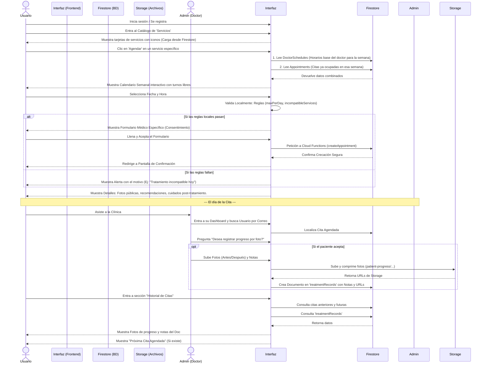

# Flujo de Citas e Historial Clínico (Elanza)

Este documento describe detalladamente el flujo funcional y la arquitectura necesaria para implementar la agendación de citas, validación de reglas de negocio, y el registro de progreso clínico con fotografías para la plataforma **Elanza**.

## 1. Diagrama de Flujo Principal (User & Admin)

El siguiente diagrama ilustra el camino completo desde que el usuario busca un servicio hasta que el administrador registra su progreso.



---

## 2. Descripción Paso a Paso del Flujo (Frontend Context)

Esto sirve como directiva para los programadores de Frontend y Backend.

### Paso A: Exploración de Servicios
- **Vista:** `/servicios`
- **Acción:** Se cargan los documentos de la colección `services`. Cada servicio tiene nombre, precio, duración y el campo nuevo `images.icon` (subido por el superadmin).
- **Trigger:** Al hacer clic en el botón de agendar de una tarjeta, la app navega a `/agendar?serviceId=ID_DEL_SERVICIO`.

### Paso B: Selección de Horario (El Calendario)
- **Vista:** Modal o Pestaña de Calendario Semanal
- **Lógica Frontend (getAvailableSlots):**
  1. Se consulta el documento del doctor asignado en la colección `doctorSchedules`. El formato del horario lo sube el doctor semanalmente (ej. Lunes: `["09:00", "10:00", "11:00"]`).
  2. Se consultan de la colección `appointments` todas las citas en estado `scheduled` para esa semana.
  3. El frontend calcula y tacha/desactiva los horarios (slots) que ya estén cruzados con una cita existente o que queden en el pasado.
  4. Si hay horarios disponibles, el usuario selecciona uno.

### Paso C: Validaciones y Consentimiento
- **Acción:** Al seleccionar el horario y dar "Continuar".
- **Lógica Pre-Vuelo:** El frontend ejecuta validaciones contra el documento del servicio:
  - ¿Alcanzó el `bookingRules.maxPerWeek`?
  - ¿Trata de agendar algo en un mismo día incluido en `incompatibleSameDayServices`?
- **El Formulario Médico:** Si las reglas pasan, se pinta en pantalla el arreglo `medicalFormFields` (Preguntas booleanas y textos configuradas en `update_service`).
- **Submit:** Al aceptar el formulario, se envían los datos a Firebase Cloud Functions (`createAppointment`) para garantizar la escritura atómica.

### Paso D: Pantalla de Confirmación de Cita
- **Vista:** `/cita/confirmacion/:appointmentId`
- **UI:** Se muestra la información estática del servicio para educar al paciente.
  - Campos a usar: `description`, `recommendations`, `contraindications`, `aftercare`.
  - Imágenes a usar: `images.banner` y el arreglo de `images.gallery`.

---

## 3. El Flujo de Administración y Progreso Médico (Dashboard Admin)

### Paso A: Búsqueda del Paciente
- El Doctor/Administrador entra al **Dashboard Interno**.
- Usa una barra de búsqueda para ubicar al paciente por su **correo electrónico** o nombre.
- El sistema busca en la colección `users` y enlista su historial de `appointments`.

### Paso B: Registro de Sesión (Fotos y Notas)
- Sobre la cita del paciente del día de hoy, el doc da clic en un botón: **"Registrar Progreso (Notas/Fotos)"**.
- Si el paciente da su consentimiento verbal, el doctor:
  1. Escribe notas clínicas de estado o evolución de la sesión.
  2. Selecciona/Toma fotos del **Antes** y del **Después** (si aplica).
- El sistema sube las fotos a Firebase Storage en la ruta segura (`patient-progress/{userId}/{appointmentId}-before.webp`).
- Y se genera el documento final en Firestore:

**Colección `treatmentRecords`:**
```json
{
  "userId": "jhon.doe@email.com",
  "appointmentId": "f78d912k",
  "serviceId": "drenaje_linfatico",
  "doctorId": "doc_xyz",
  "date": "2024-03-01T10:00:00Z",
  "notes": "El paciente..." ,
  "progressPhotos": {
    "before": "https://...",
    "after": "https://..."
  }
}
```

---

## 4. Vista Final del Cliente (Historial de Usuario)

### Dashboard del Paciente (`/perfil/historial`)
Cuando el cliente se loguea para revisar su estado, ve dos secciones primordiales en su pantalla:

1. **Card Superior (Próximos Eventos):**
   - El sistema consulta la colección `appointments` donde `userId == id_autenticado` y `startTime > hoy`.
   - Muestra un aviso gigante: "Tu próxima cita de *Drenaje Linfático* es el Jueves a las 10:00 AM".

2. **Lista Inferior (Historial Clínico / Progreso):**
   - El sistema hace un "join" virtual buscando todos los documentos en `treatmentRecords` que le pertenecen a este usuario, ordenados desde el más reciente.
   - Si el doctor le tomó fotos, la UI carga las fotos del *Antes y Después*, permitiéndole al usuario ver gráficamente en su teléfono cómo el servicio le ha estado ayudando, acompañado de las notas públicas del doctor.

### Restricciones de Privacidad y Costos
- **Privacidad:** Las reglas de seguridad de Storage de Firebase están configuradas explícitamente para que la ruta de almacenamiento de fotos clínicas solo pueda ser leída por el usuario que es dueño del `userId` y por el personal `Administrador / Doctor`. Nula exposición pública.
- **Limpieza (Auto-delete):** Se debe configurar una regla "Lifecycle" en Google Cloud Storage en el bucket `patient-progress/` para expirar/borrar permanentemente los objetos tras **30 días** de haber sido creados, evitando acumular costos de retención y cumpliendo normativas de retención de imágenes temporales.
